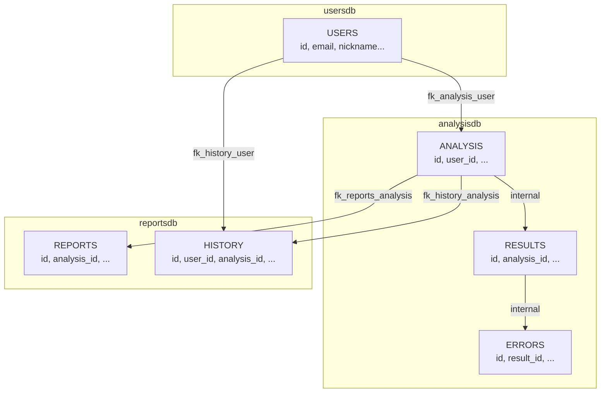

# 🔗 Migraciones Cross-Database - Microservicios de Accesibilidad

## 📋 Resumen de Implementación

Este documento consolida todas las migraciones cross-database implementadas entre los microservicios de accesibilidad.

## 🗄️ Arquitectura de Relaciones



## 🚀 Migraciones Implementadas

### 1. **ANALYSIS → USERS**

- **📁 Archivo**: `20250823161451_AddUserForeignKeyConstraint.cs`
- **🎯 Microservicio**: accessibility-ms-analysis
- **💻 Constraint**: `fk_analysis_user`
- **🔗 Relación**: `analysisdb.ANALYSIS(user_id) → usersdb.USERS(id)`

```sql
ALTER TABLE ANALYSIS
ADD CONSTRAINT fk_analysis_user
FOREIGN KEY (user_id) REFERENCES usersdb.USERS(id)
ON DELETE CASCADE;
```

### 2. **REPORTS → ANALYSIS**

- **📁 Archivo**: `20250823161529_AddAnalysisForeignKeyConstraint.cs`
- **🎯 Microservicio**: accessibility-ms-reports
- **💻 Constraints**: `fk_reports_analysis` + `fk_history_analysis`
- **🔗 Relaciones**:
  - `reportsdb.REPORTS(analysis_id) → analysisdb.ANALYSIS(id)`
  - `reportsdb.HISTORY(analysis_id) → analysisdb.ANALYSIS(id)`

```sql
ALTER TABLE REPORTS
ADD CONSTRAINT fk_reports_analysis
FOREIGN KEY (analysis_id) REFERENCES analysisdb.ANALYSIS(id)
ON DELETE CASCADE;

ALTER TABLE HISTORY
ADD CONSTRAINT fk_history_analysis
FOREIGN KEY (analysis_id) REFERENCES analysisdb.ANALYSIS(id)
ON DELETE CASCADE;
```

### 3. **HISTORY → USERS**

- **📁 Archivo**: `20250823161603_AddUserForeignKeyConstraint.cs`
- **🎯 Microservicio**: accessibility-ms-reports
- **💻 Constraint**: `fk_history_user`
- **🔗 Relación**: `reportsdb.HISTORY(user_id) → usersdb.USERS(id)`

```sql
ALTER TABLE HISTORY
ADD CONSTRAINT fk_history_user
FOREIGN KEY (user_id) REFERENCES usersdb.USERS(id)
ON DELETE CASCADE;
```

## ⚠️ Orden de Aplicación de Migraciones

### **Secuencia Requerida:**

1. 🥇 **Users** - Aplicar todas las migraciones (crear tabla base)
2. 🥈 **Analysis** - Aplicar migraciones + FK hacia Users
3. 🥉 **Reports** - Aplicar migraciones + FK hacia Analysis y Users

### **Comandos por microservicio:**

```bash
# 1. Users (primero)
cd C:\Git\accessibility-ms-users
dotnet ef database update --project src/Users.Infrastructure --startup-project src/Users.Api

# 2. Analysis (segundo - requiere Users)
cd C:\Git\accessibility-ms-analysis
dotnet ef database update --project src/Analysis.Infrastructure --startup-project src/Analysis.Api

# 3. Reports (tercero - requiere Users y Analysis)
cd C:\Git\accessibility-ms-reports
dotnet ef database update --project src/Reports.Infrastructure --startup-project src/Reports.Api
```

## 🔍 Validación Post-Migración

### **Verificar constraints activas:**

```sql
-- Ver todas las constraints cross-database
SELECT
    TABLE_SCHEMA,
    TABLE_NAME,
    CONSTRAINT_NAME,
    COLUMN_NAME,
    REFERENCED_TABLE_SCHEMA,
    REFERENCED_TABLE_NAME,
    REFERENCED_COLUMN_NAME,
    DELETE_RULE
FROM information_schema.KEY_COLUMN_USAGE
WHERE REFERENCED_TABLE_SCHEMA IS NOT NULL
  AND TABLE_SCHEMA IN ('analysisdb', 'reportsdb')
ORDER BY TABLE_SCHEMA, TABLE_NAME;
```

### **Resultado esperado:**

| TABLE_SCHEMA | TABLE_NAME | CONSTRAINT_NAME     | REFERENCED_TABLE_SCHEMA | REFERENCED_TABLE_NAME |
| ------------ | ---------- | ------------------- | ----------------------- | --------------------- |
| analysisdb   | ANALYSIS   | fk_analysis_user    | usersdb                 | USERS                 |
| reportsdb    | REPORTS    | fk_reports_analysis | analysisdb              | ANALYSIS              |
| reportsdb    | HISTORY    | fk_history_analysis | analysisdb              | ANALYSIS              |
| reportsdb    | HISTORY    | fk_history_user     | usersdb                 | USERS                 |

## 🛡️ Consideraciones de Producción

### **Backup antes de aplicar:**

```bash
# Backup completo antes de aplicar migraciones
mysqldump -u [usuario] -p --all-databases > backup_pre_cross_fk.sql
```

### **Validación de datos:**

```sql
-- Verificar consistencia de datos antes de aplicar FKs
-- Usuarios sin registros correspondientes en ANALYSIS
SELECT DISTINCT user_id
FROM analysisdb.ANALYSIS
WHERE user_id NOT IN (SELECT id FROM usersdb.USERS);

-- Análisis sin registros correspondientes en REPORTS
SELECT DISTINCT analysis_id
FROM reportsdb.REPORTS
WHERE analysis_id NOT IN (SELECT id FROM analysisdb.ANALYSIS);

-- Usuarios sin registros correspondientes en HISTORY
SELECT DISTINCT user_id
FROM reportsdb.HISTORY
WHERE user_id NOT IN (SELECT id FROM usersdb.USERS);
```

## 📊 Resumen de Constraints Implementadas

### ✅ **TODAS LAS CONSTRAINTS REQUERIDAS:**

| Constraint            | Tabla Origen          | Tabla Destino         | Estado |
| --------------------- | --------------------- | --------------------- | ------ |
| `fk_analysis_user`    | `analysisdb.ANALYSIS` | `usersdb.USERS`       | ✅     |
| `fk_reports_analysis` | `reportsdb.REPORTS`   | `analysisdb.ANALYSIS` | ✅     |
| `fk_history_analysis` | `reportsdb.HISTORY`   | `analysisdb.ANALYSIS` | ✅     |
| `fk_history_user`     | `reportsdb.HISTORY`   | `usersdb.USERS`       | ✅     |

### ✅ **CONSTRAINTS INTERNAS (ya existían):**

| Microservicio | Constraint             | Estado |
| ------------- | ---------------------- | ------ |
| Analysis      | `FK_RESULTS_ANALYSIS`  | ✅     |
| Analysis      | `FK_ERRORS_RESULTS`    | ✅     |
| Users         | `FK_SESSIONS_USERS`    | ✅     |
| Users         | `FK_PREFERENCES_USERS` | ✅     |

---

_📅 Implementado: 23 de agosto de 2025_  
_🔧 Migraciones: 3 cross-database constraints_  
_✅ Estado: Listo para aplicar_
