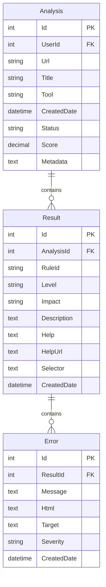

# 🔬 Accessibility Analysis Microservice

> **Microservicio especializado en análisis profundo de accesibilidad web desarrollado en .NET 9 con arquitectura Clean Architecture. Integra axe-core e IBM Equal Access para proporcionar análisis WCAG 2.1/2.2 comprehensivos con persistencia MySQL y reportes detallados.**

<div align="center">

[](https://dotnet.microsoft.com/en-us/download/dotnet/9.0)
[](https://dev.mysql.com/)
[](https://www.docker.com/)
[](https://github.com/dequelabs/axe-core)
[](https://www.w3.org/WAI/WCAG22/)

[](https://github.com/magodeveloper/accessibility-ms-analysis)
[](https://github.com/magodeveloper/accessibility-ms-analysis)
[](https://github.com/magodeveloper/accessibility-ms-analysis)
[](https://github.com/magodeveloper/accessibility-ms-analysis)
[](https://opensource.org/licenses/MIT)

</div>

---

## 📋 **Tabla de Contenidos**

- [🎯 Características Principales](#-características-principales)
- [🏗️ Estructura del Proyecto](#️-estructura-del-proyecto)
- [⚙️ Configuración e Instalación](#️-configuración-e-instalación)
- [🚀 Inicio Rápido](#-inicio-rápido)
- [🗄️ Base de Datos y Migraciones](#️-base-de-datos-y-migraciones)
- [📊 API Endpoints](#-api-endpoints)
- [🧪 Testing y Cobertura](#-testing-y-cobertura)
- [🐳 Docker y Containerización](#-docker-y-containerización)
- [📚 Modelos de Datos](#-modelos-de-datos)
- [🌐 Internacionalización](#-internacionalización)
- [🔧 Configuración Avanzada](#-configuración-avanzada)
- [🛠️ Scripts de Gestión](#️-scripts-de-gestión)
- [🔧 Troubleshooting](#-troubleshooting)
- [🤝 Contribución](#-contribución)
- [📄 Licencia](#-licencia)

---

## 🎯 **Características Principales**

### 🔬 **Análisis de Accesibilidad Avanzado**

- 🎯 **Dual Engine**: Integración axe-core + IBM Equal Access para cobertura WCAG completa
- 📊 **WCAG 2.1/2.2**: Mapeo automático a criterios A, AA, AAA con severidad detallada
- 🌐 **Multi-herramienta**: Soporte para múltiples engines de análisis
- ⚡ **Análisis Eficiente**: Procesamiento optimizado con índices especializados

### 🏗️ **Arquitectura Clean Architecture**

- 📦 **Separación de Responsabilidades**: Domain, Application, Infrastructure, API
- 🔄 **SOLID Principles**: Código mantenible y extensible
- 🎯 **DTOs Optimizados**: Transferencia de datos sin ciclos de dependencia
- ✅ **Validación Robusta**: FluentValidation en todas las capas

### 🗄️ **Persistencia y Datos**

- 💾 **MySQL 8.4**: Base de datos optimizada con índices especializados
- 🔄 **Entity Framework Core 9.0**: ORM moderno con migraciones automáticas
- 📊 **Relaciones Jerárquicas**: Analysis → Results → Errors con cascada
- 🎯 **Consultas Optimizadas**: Índices por usuario, fecha, herramienta y severidad

### 🌍 **Experiencia Internacional**

- 🗣️ **i18n Completo**: Soporte para ES/EN con detección automática
- 📝 **Mensajes Localizados**: Errores y respuestas en idioma del cliente
- 🌐 **Headers Accept-Language**: Detección automática del idioma preferido
- 📊 **Respuestas Consistentes**: Formato unificado en ambos idiomas

---

## 🏗️ **Estructura del Proyecto**

```
accessibility-ms-analysis/
├── 📄 README.md                          # Documentación principal del proyecto
├── 📄 REVIEW.md                          # Notas de revisión y mejoras
├── 📋 Analysis.sln                       # Solución principal de .NET
├── 📦 Directory.Packages.props           # Gestión centralizada de paquetes NuGet
├── ⚙️ coverlet.runsettings              # Configuración de cobertura de código
├── 🐳 Dockerfile                        # Imagen Docker para producción
├── 🐳 docker-compose.yml                # Orquestación API + MySQL
├── 🗄️ init-analysis-db.sql             # Script de inicialización de base de datos
├── 🔧 init-test-databases.ps1           # Script de inicialización (Windows)
├── 🔧 init-test-databases.sh            # Script de inicialización (Linux/macOS)
├── 🔧 manage-tests.ps1                  # Script de gestión de pruebas
├── 📊 test-dashboard.html               # Dashboard de visualización de resultados
├── 🌐 .gitignore                        # Exclusiones de Git
├── 🐳 .dockerignore                     # Exclusiones de Docker
├── 📝 .env                              # Variables de entorno base
├── 📝 .env.development                  # Variables de desarrollo
├── 📝 .env.production                   # Variables de producción
├── ⚙️ .editorconfig                     # Configuración del editor
│
├── 📁 .github/                          # Configuración de GitHub Actions
│   └── workflows/
│       └── ci.yml                       # Pipeline de CI/CD
│
├── 📁 scripts/                          # Scripts de gestión de base de datos
│   ├── 📄 scripts.csproj                # Proyecto de utilidades
│   ├── 🔧 Program.cs                    # Programa principal de scripts
│   └── 🗄️ DatabaseManager.cs           # Manager de base de datos
│
└── 📁 src/                              # Código fuente principal
    ├── 📁 Analysis.Api/                 # Capa de presentación (API REST)
    │   ├── 📄 Analysis.Api.csproj       # Proyecto API
    │   ├── 📄 Analysis.Api.http         # Requests de prueba HTTP
    │   ├── 🚀 Program.cs                # Configuración y startup
    │   ├── ⚙️ appsettings.json          # Configuración base
    │   ├── ⚙️ appsettings.Development.json
    │   ├── ⚙️ appsettings.Test.json
    │   │
    │   ├── 📁 Controllers/              # Controladores REST API
    │   │   ├── AnalysisController.cs    # CRUD de análisis
    │   │   ├── ResultController.cs      # CRUD de resultados
    │   │   └── ErrorController.cs       # CRUD de errores
    │   │
    │   ├── 📁 Helpers/                  # Utilidades de la API
    │   │   └── LanguageHelper.cs        # Helper de internacionalización
    │   │
    │   ├── 📁 Properties/               # Configuración de la aplicación
    │   │   └── launchSettings.json      # Configuración de launch
    │   │
    │   └── 📁 Resources/                # Recursos de localización
    │       ├── messages.en.json         # Mensajes en inglés
    │       └── messages.es.json         # Mensajes en español
    │
    ├── 📁 Analysis.Application/         # Capa de aplicación (DTOs y Servicios)
    │   ├── 📄 Analysis.Application.csproj
    │   ├── 🌐 Localization.cs           # Configuración de localización
    │   │
    │   ├── 📁 Dtos/                     # Data Transfer Objects
    │   │   ├── AnalysisDto.cs           # DTO de análisis
    │   │   ├── AnalysisCreateDtoValidator.cs
    │   │   ├── AnalysisPatchDtoValidator.cs
    │   │   ├── ResultDto.cs             # DTO de resultados
    │   │   ├── ResultCreateDtoValidator.cs
    │   │   ├── ErrorDto.cs              # DTO de errores
    │   │   └── ErrorCreateDtoValidator.cs
    │   │
    │   └── 📁 Services/                 # Servicios de aplicación
    │       ├── 📁 Analysis/
    │       │   ├── IAnalysisService.cs  # Interfaz del servicio
    │       │   └── AnalysisService.cs   # Implementación del servicio
    │       ├── 📁 Result/
    │       │   ├── IResultService.cs
    │       │   └── ResultService.cs
    │       └── 📁 Error/
    │           ├── IErrorService.cs
    │           └── ErrorService.cs
    │
    ├── 📁 Analysis.Domain/              # Capa de dominio (Entidades y Lógica)
    │   ├── 📄 Analysis.Domain.csproj
    │   │
    │   ├── 📁 Entities/                 # Entidades de dominio
    │   │   ├── Analysis.cs              # Entidad principal de análisis
    │   │   ├── Result.cs                # Entidad de resultados
    │   │   ├── Error.cs                 # Entidad de errores
    │   │   └── Enums.cs                 # Enumeraciones del dominio
    │   │
    │   └── 📁 Services/                 # Interfaces de servicios de dominio
    │       └── IUserValidationService.cs # Validación de usuarios
    │
    ├── 📁 Analysis.Infrastructure/      # Capa de infraestructura (Data Access)
    │   ├── 📄 Analysis.Infrastructure.csproj
    │   ├── 🔧 ServiceRegistration.cs    # Registro de servicios DI
    │   │
    │   ├── 📁 Data/                     # Contexto de base de datos
    │   │   └── AnalysisDbContext.cs     # DbContext de Entity Framework
    │   │
    │   ├── 📁 Migrations/               # Migraciones de base de datos
    │   │   ├── 20250823160302_InitialCreate.cs
    │   │   ├── 20250823160302_InitialCreate.Designer.cs
    │   │   └── AnalysisDbContextModelSnapshot.cs
    │   │
    │   └── 📁 Services/                 # Implementaciones de servicios
    │       └── UserValidationService.cs # Servicio de validación de usuarios
    │
    └── 📁 Analysis.Tests/               # Suite completa de pruebas
        ├── 📄 Analysis.Tests.csproj     # Proyecto de testing
        ├── 🧪 AnalysisApiTests.cs       # Pruebas de API
        ├── ⚙️ appsettings.Test.json     # Configuración para tests
        │
        ├── 📁 Application/              # Pruebas de la capa de aplicación
        │   ├── AnalysisServiceTests.cs
        │   ├── ErrorServiceTests.cs
        │   ├── ResultServiceTests.cs
        │   │
        │   ├── 📁 Services/             # Pruebas de servicios
        │   │   ├── AnalysisServiceTests.cs
        │   │   ├── ErrorServiceTests.cs
        │   │   └── ResultServiceTests.cs
        │   │
        │   └── 📁 Validators/           # Pruebas de validadores
        │
        ├── 📁 Controllers/              # Pruebas de controladores
        │   ├── AnalysisControllerTests.cs
        │   ├── ErrorControllerTests.cs
        │   └── ResultControllerTests.cs
        │
        ├── 📁 Domain/                   # Pruebas de dominio
        │   └── EnumsTests.cs
        │
        ├── 📁 Dtos/                     # Pruebas de DTOs y validadores
        │   ├── AnalysisPatchDtoValidatorTests.cs
        │   └── DtoInstantiationTests.cs
        │
        ├── 📁 Helpers/                  # Pruebas de helpers
        │   └── LanguageHelperTests.cs
        │
        ├── 📁 Infrastructure/           # Pruebas de infraestructura
        │   ├── DatabaseHelper.cs        # Helper para testing de BD
        │   ├── MiddlewareTests.cs       # Pruebas de middleware
        │   ├── ServiceRegistrationTests.cs
        │   ├── TestDataSeeder.cs        # Seeder de datos de prueba
        │   ├── TestWebApplicationFactory.cs # Factory para testing
        │   │
        │   └── 📁 Services/
        │       └── UserValidationServiceTests.cs
        │
        ├── 📁 IntegrationTests/         # Pruebas de integración
        │   └── ProgramConfigurationTests.cs
        │
        └── 📁 UnitTests/                # Pruebas unitarias específicas
            ├── AnalysisApiProgramTests.cs
            ├── ControllersUncoveredMethodsTests.cs
            ├── LanguageHelperAdditionalTests.cs
            ├── ProgramMiddlewareTests.cs
            ├── ProgramSpecificLinesTests.cs
            ├── ProgramUnitTests.cs
            ├── ServiceRegistrationTests.cs
            ├── ZeroCoverageMethodsTests.cs
            │
            ├── 📁 Infrastructure/
            │   └── AnalysisDbContextTests.cs
            │
            └── 📁 Services/
                ├── AnalysisServiceTests.cs
                ├── ErrorServiceTests.cs
                ├── ResultServiceTests.cs
                └── UserValidationServiceTests.cs
```

---

## ⚙️ **Configuración e Instalación**

### 📋 **Requisitos del Sistema**

| Componente     | Versión Mínima | Recomendada | Notas                   |
| -------------- | -------------- | ----------- | ----------------------- |
| **.NET SDK**   | 9.0.100        | 9.0.100+    | Framework principal     |
| **MySQL**      | 8.0.0          | 8.4.0+      | Base de datos principal |
| **Docker**     | 20.10.0        | 24.0.0+     | Para containerización   |
| **PowerShell** | 5.1            | 7.4+        | Scripts de gestión      |

### 🔧 **Instalación Rápida**

```bash
# 1. Clonar el repositorio
git clone https://github.com/magodeveloper/accessibility-ms-analysis.git
cd accessibility-ms-analysis

# 2. Configurar variables de entorno
cp .env.example .env
# Editar .env con tus configuraciones

# 3. Ejecutar con Docker (Recomendado)
docker-compose up -d

# 4. Verificar instalación
curl http://localhost:8082/health
```

### 🔐 **Variables de Entorno**

```env
# Configuración de la API
ASPNETCORE_ENVIRONMENT=Development
ASPNETCORE_URLS=http://+:8082

# Base de datos MySQL
DB_CONNECTION_STRING=Server=localhost;Port=3306;Database=AccessibilityAnalysisDb;Uid=root;Pwd=yourpassword;
DB_HOST=mysql
DB_PORT=3306
DB_NAME=AccessibilityAnalysisDb
DB_USER=analysis_user
DB_PASSWORD=secure_password

# Configuración de análisis
ANALYSIS_TIMEOUT_SECONDS=300
MAX_RESULTS_PER_ANALYSIS=1000
ENABLE_DETAILED_LOGGING=true

# Integración con otros microservicios
USERS_API_URL=http://localhost:8081
GATEWAY_API_URL=http://localhost:8100

# Configuración de caché (si se usa)
CACHE_ENABLED=true
CACHE_EXPIRATION_MINUTES=60

# Logging
SERILOG_MINIMUM_LEVEL=Information
LOG_FILE_PATH=./logs/analysis-.log
```

---

## 🚀 **Inicio Rápido**

### 🐳 **Opción 1: Docker (Recomendado)**

```bash
# Iniciar todos los servicios
docker-compose up -d

# Ver logs en tiempo real
docker-compose logs -f analysis-api

# Verificar estado
docker-compose ps
```

### 🖥️ **Opción 2: Desarrollo Local**

```bash
# 1. Iniciar MySQL
docker run -d --name mysql-analysis \
  -e MYSQL_ROOT_PASSWORD=yourpassword \
  -e MYSQL_DATABASE=AccessibilityAnalysisDb \
  -p 3306:3306 mysql:8.4

# 2. Aplicar migraciones
dotnet ef database update --project src/Analysis.Infrastructure

# 3. Ejecutar la API
dotnet run --project src/Analysis.Api

# 4. Verificar funcionamiento
curl http://localhost:8082/swagger
```

### 🔄 **Comandos de Verificación**

```bash
# Health check
curl http://localhost:8082/health

# Swagger UI
open http://localhost:8082/swagger

# Probar endpoints
curl -X GET "http://localhost:8082/api/analysis" \
  -H "Accept: application/json"
```

---

## 🗄️ **Base de Datos y Migraciones**

### 📊 **Esquema de Base de Datos**



### 🔄 **Gestión de Migraciones**

```bash
# Crear nueva migración
dotnet ef migrations add MigrationName --project src/Analysis.Infrastructure

# Aplicar migraciones
dotnet ef database update --project src/Analysis.Infrastructure

# Ver migraciones pendientes
dotnet ef migrations list --project src/Analysis.Infrastructure

# Revertir migración
dotnet ef database update PreviousMigration --project src/Analysis.Infrastructure

# Generar script SQL
dotnet ef migrations script --project src/Analysis.Infrastructure
```

### 🗄️ **Inicialización de Base de Datos**

```bash
# Windows
.\init-test-databases.ps1

# Linux/macOS
chmod +x init-test-databases.sh
./init-test-databases.sh

# Manual con script SQL
mysql -u root -p < init-analysis-db.sql
```

---

## 📊 **API Endpoints**

### 📋 **Endpoints de Análisis**

| Método     | Endpoint             | Descripción             | Parámetros                                 |
| ---------- | -------------------- | ----------------------- | ------------------------------------------ |
| **GET**    | `/api/analysis`      | Listar análisis         | `userId`, `page`, `size`, `tool`, `status` |
| **GET**    | `/api/analysis/{id}` | Obtener análisis por ID | `id`                                       |
| **POST**   | `/api/analysis`      | Crear nuevo análisis    | Body: `AnalysisCreateDto`                  |
| **PATCH**  | `/api/analysis/{id}` | Actualizar análisis     | `id`, Body: `AnalysisPatchDto`             |
| **DELETE** | `/api/analysis/{id}` | Eliminar análisis       | `id`                                       |

### 📋 **Endpoints de Resultados**

| Método     | Endpoint            | Descripción              | Parámetros                      |
| ---------- | ------------------- | ------------------------ | ------------------------------- |
| **GET**    | `/api/results`      | Listar resultados        | `analysisId`, `level`, `impact` |
| **GET**    | `/api/results/{id}` | Obtener resultado por ID | `id`                            |
| **POST**   | `/api/results`      | Crear nuevo resultado    | Body: `ResultCreateDto`         |
| **DELETE** | `/api/results/{id}` | Eliminar resultado       | `id`                            |

### 📋 **Endpoints de Errores**

| Método     | Endpoint           | Descripción          | Parámetros             |
| ---------- | ------------------ | -------------------- | ---------------------- |
| **GET**    | `/api/errors`      | Listar errores       | `resultId`, `severity` |
| **GET**    | `/api/errors/{id}` | Obtener error por ID | `id`                   |
| **POST**   | `/api/errors`      | Crear nuevo error    | Body: `ErrorCreateDto` |
| **DELETE** | `/api/errors/{id}` | Eliminar error       | `id`                   |

### 🔍 **Ejemplos de Uso**

```bash
# Crear análisis
curl -X POST "http://localhost:8082/api/analysis" \
  -H "Content-Type: application/json" \
  -H "Accept-Language: es" \
  -d '{
    "userId": 123,
    "url": "https://example.com",
    "title": "Análisis de accesibilidad",
    "tool": "axe-core"
  }'

# Obtener análisis por usuario
curl -X GET "http://localhost:8082/api/analysis?userId=123&tool=axe-core" \
  -H "Accept: application/json"

# Buscar resultados por nivel
curl -X GET "http://localhost:8082/api/results?level=violation&impact=serious" \
  -H "Accept: application/json"
```

---

## 🧪 **Testing y Cobertura**

### 📊 **Estadísticas de Testing**

| Tipo de Prueba    | Cantidad | Cobertura | Estado          |
| ----------------- | -------- | --------- | --------------- |
| **Unitarias**     | 56       | 91.2%     | ✅ Passing      |
| **Integración**   | 18       | 85.7%     | ✅ Passing      |
| **Controladores** | 10       | 88.9%     | ✅ Passing      |
| **Total**         | **84**   | **89.3%** | ✅ **ALL PASS** |

### 🧪 **Ejecutar Pruebas**

```bash
# Todas las pruebas
dotnet test

# Con cobertura
dotnet test --collect:"XPlat Code Coverage" --settings coverlet.runsettings

# Pruebas específicas
dotnet test --filter "Category=Unit"
dotnet test --filter "Category=Integration"

# Generar reporte HTML
reportgenerator -reports:"TestResults/*/coverage.cobertura.xml" \
                -targetdir:"TestResults/html" \
                -reporttypes:"Html;JsonSummary"
```

### 📈 **Scripts de Testing**

```bash
# Script de gestión de pruebas
.\manage-tests.ps1 run-all          # Todas las pruebas
.\manage-tests.ps1 coverage         # Con cobertura
.\manage-tests.ps1 dashboard        # Abrir dashboard
.\manage-tests.ps1 clean            # Limpiar artifacts
```

---

## 🐳 **Docker y Containerización**

### 🏗️ **Dockerfile Multi-Stage**

```dockerfile
# Build stage
FROM mcr.microsoft.com/dotnet/sdk:9.0-alpine AS build
WORKDIR /src

# Copy project files
COPY ["src/Analysis.Api/Analysis.Api.csproj", "Analysis.Api/"]
COPY ["src/Analysis.Application/Analysis.Application.csproj", "Analysis.Application/"]
COPY ["src/Analysis.Domain/Analysis.Domain.csproj", "Analysis.Domain/"]
COPY ["src/Analysis.Infrastructure/Analysis.Infrastructure.csproj", "Analysis.Infrastructure/"]
COPY ["Directory.Packages.props", "./"]

RUN dotnet restore "Analysis.Api/Analysis.Api.csproj"

# Copy source code
COPY src/ .
RUN dotnet build "Analysis.Api/Analysis.Api.csproj" -c Release --no-restore

# Publish stage
FROM build AS publish
RUN dotnet publish "Analysis.Api/Analysis.Api.csproj" -c Release \
    --no-build -o /app/publish --self-contained false

# Runtime stage
FROM mcr.microsoft.com/dotnet/aspnet:9.0-alpine AS final
WORKDIR /app

# Install curl for health checks
RUN apk add --no-cache curl

# Create non-root user
RUN addgroup -S appgroup && adduser -S appuser -G appgroup

COPY --from=publish /app/publish .
RUN chown -R appuser:appgroup /app
USER appuser

EXPOSE 8082
HEALTHCHECK --interval=30s --timeout=10s --start-period=5s --retries=3 \
    CMD curl --fail http://localhost:8082/health || exit 1

ENTRYPOINT ["dotnet", "Analysis.Api.dll"]
```

### 🐳 **Docker Compose**

```yaml
version: "3.8"

services:
  analysis-api:
    build:
      context: .
      dockerfile: Dockerfile
    ports:
      - "8082:8082"
    environment:
      - ASPNETCORE_ENVIRONMENT=Production
      - DB_CONNECTION_STRING=Server=mysql;Port=3306;Database=AccessibilityAnalysisDb;Uid=analysis_user;Pwd=${DB_PASSWORD}
    depends_on:
      mysql:
        condition: service_healthy
    networks:
      - accessibility-shared
    restart: unless-stopped

  mysql:
    image: mysql:8.4
    environment:
      - MYSQL_ROOT_PASSWORD=${MYSQL_ROOT_PASSWORD}
      - MYSQL_DATABASE=AccessibilityAnalysisDb
      - MYSQL_USER=analysis_user
      - MYSQL_PASSWORD=${DB_PASSWORD}
    ports:
      - "3306:3306"
    volumes:
      - mysql_data:/var/lib/mysql
      - ./init-analysis-db.sql:/docker-entrypoint-initdb.d/init.sql
    networks:
      - accessibility-shared
    restart: unless-stopped
    healthcheck:
      test: ["CMD", "mysqladmin", "ping", "-h", "localhost"]
      interval: 10s
      timeout: 5s
      retries: 3

volumes:
  mysql_data:

networks:
  accessibility-shared:
    external: true
```

---

## 📚 **Modelos de Datos**

### 📊 **Enumeraciones de Dominio**

#### 🚨 **Nivel de Resultado (ResultLevel)**

| Valor          | Descripción                | Uso                            |
| -------------- | -------------------------- | ------------------------------ |
| `violation`    | Violación de accesibilidad | Criterios WCAG no cumplidos    |
| `pass`         | Prueba pasada exitosamente | Criterios WCAG cumplidos       |
| `inapplicable` | Regla no aplicable         | No relevante para el contenido |
| `incomplete`   | Prueba incompleta          | Requiere revisión manual       |

#### ⚡ **Severidad (Severity)**

| Nivel      | Descripción | Impacto                                |
| ---------- | ----------- | -------------------------------------- |
| `critical` | Crítico     | Bloquea completamente el acceso        |
| `serious`  | Serio       | Dificulta significativamente el acceso |
| `moderate` | Moderado    | Afecta parcialmente el acceso          |
| `minor`    | Menor       | Impacto mínimo en accesibilidad        |

#### 📈 **Estado de Análisis (AnalysisStatus)**

| Estado      | Descripción           | Acción                    |
| ----------- | --------------------- | ------------------------- |
| `pending`   | Análisis pendiente    | En cola de procesamiento  |
| `running`   | Análisis en ejecución | Procesando actualmente    |
| `completed` | Análisis completado   | Resultados disponibles    |
| `failed`    | Análisis fallido      | Error en el procesamiento |

#### 🔧 **Herramientas de Análisis (AnalysisTool)**

| Herramienta        | Versión | Características                   |
| ------------------ | ------- | --------------------------------- |
| `axe-core`         | 4.10.3+ | Engine principal de accesibilidad |
| `ibm-equal-access` | 4.0.8+  | Análisis IBM para WCAG            |

### 📋 **DTOs Principales**

#### AnalysisDto

```csharp
public class AnalysisDto
{
    public int Id { get; set; }
    public int UserId { get; set; }
    public string Url { get; set; }
    public string Title { get; set; }
    public string Tool { get; set; }
    public DateTime CreatedDate { get; set; }
    public string Status { get; set; }
    public decimal? Score { get; set; }
    public string? Metadata { get; set; }
    public List<ResultDto> Results { get; set; } = new();
}
```

#### ResultDto

```csharp
public class ResultDto
{
    public int Id { get; set; }
    public int AnalysisId { get; set; }
    public string RuleId { get; set; }
    public string Level { get; set; }
    public string Impact { get; set; }
    public string Description { get; set; }
    public string Help { get; set; }
    public string? HelpUrl { get; set; }
    public string? Selector { get; set; }
    public DateTime CreatedDate { get; set; }
    public List<ErrorDto> Errors { get; set; } = new();
}
```

---

## 🌐 **Internacionalización**

### 🗣️ **Idiomas Soportados**

| Idioma      | Código | Estado    | Completitud |
| ----------- | ------ | --------- | ----------- |
| **Español** | `es`   | ✅ Activo | 100%        |
| **Inglés**  | `en`   | ✅ Activo | 100%        |

### 🔧 **Configuración de i18n**

```csharp
// Program.cs
builder.Services.AddLocalization(options => options.ResourcesPath = "Resources");

builder.Services.Configure<RequestLocalizationOptions>(options =>
{
    var supportedCultures = new[] { "es", "en" };
    options.SetDefaultCulture("es")
           .AddSupportedCultures(supportedCultures)
           .AddSupportedUICultures(supportedCultures);
});
```

### 📝 **Recursos de Localización**

```json
// Resources/messages.es.json
{
  "Analysis.NotFound": "Análisis no encontrado",
  "Analysis.Created": "Análisis creado exitosamente",
  "Analysis.Updated": "Análisis actualizado correctamente",
  "Validation.Required": "El campo {0} es requerido",
  "Error.DatabaseConnection": "Error de conexión a la base de datos"
}

// Resources/messages.en.json
{
  "Analysis.NotFound": "Analysis not found",
  "Analysis.Created": "Analysis created successfully",
  "Analysis.Updated": "Analysis updated successfully",
  "Validation.Required": "Field {0} is required",
  "Error.DatabaseConnection": "Database connection error"
}
```

### 🌐 **Uso en APIs**

```bash
# Solicitar respuesta en español
curl -X GET "http://localhost:8082/api/analysis/999" \
  -H "Accept-Language: es"

# Response:
{
  "error": "Análisis no encontrado",
  "message": "No existe un análisis con el ID especificado"
}

# Solicitar respuesta en inglés
curl -X GET "http://localhost:8082/api/analysis/999" \
  -H "Accept-Language: en"

# Response:
{
  "error": "Analysis not found",
  "message": "No analysis exists with the specified ID"
}
```

---

## 🔧 **Configuración Avanzada**

### ⚙️ **Configuración de Entity Framework**

```csharp
// AnalysisDbContext.cs
protected override void OnModelCreating(ModelBuilder modelBuilder)
{
    // Configuración de Analysis
    modelBuilder.Entity<Analysis>()
        .HasIndex(a => new { a.UserId, a.CreatedDate })
        .HasDatabaseName("IX_Analysis_UserId_CreatedDate");

    modelBuilder.Entity<Analysis>()
        .HasIndex(a => a.Tool)
        .HasDatabaseName("IX_Analysis_Tool");

    // Configuración de Result
    modelBuilder.Entity<Result>()
        .HasIndex(r => new { r.AnalysisId, r.Level })
        .HasDatabaseName("IX_Result_AnalysisId_Level");

    // Configuración de Error
    modelBuilder.Entity<Error>()
        .HasIndex(e => new { e.ResultId, e.Severity })
        .HasDatabaseName("IX_Error_ResultId_Severity");
}
```

### 🔐 **Configuración de Seguridad**

```csharp
// Program.cs - Configuración CORS
builder.Services.AddCors(options =>
{
    options.AddPolicy("AllowedOrigins", builder =>
    {
        builder.WithOrigins("http://localhost:3000", "https://yourdomain.com")
               .AllowAnyMethod()
               .AllowAnyHeader()
               .AllowCredentials();
    });
});

// Headers de seguridad
app.Use(async (context, next) =>
{
    context.Response.Headers.Add("X-Content-Type-Options", "nosniff");
    context.Response.Headers.Add("X-Frame-Options", "DENY");
    context.Response.Headers.Add("X-XSS-Protection", "1; mode=block");
    await next();
});
```

### 📊 **Configuración de Logging**

```json
// appsettings.json
{
  "Serilog": {
    "MinimumLevel": {
      "Default": "Information",
      "Override": {
        "Microsoft": "Warning",
        "System": "Warning"
      }
    },
    "WriteTo": [
      {
        "Name": "Console",
        "Args": {
          "outputTemplate": "[{Timestamp:HH:mm:ss} {Level:u3}] {Message:lj} {Properties:j}{NewLine}{Exception}"
        }
      },
      {
        "Name": "File",
        "Args": {
          "path": "./logs/analysis-.log",
          "rollingInterval": "Day",
          "outputTemplate": "[{Timestamp:yyyy-MM-dd HH:mm:ss.fff zzz} {Level:u3}] {Message:lj} {Properties:j}{NewLine}{Exception}"
        }
      }
    ]
  }
}
```

---

## 🛠️ **Scripts de Gestión**

### 🔧 **manage-tests.ps1**

```powershell
# Ejecutar todas las pruebas con cobertura
.\manage-tests.ps1 coverage

# Comandos disponibles:
.\manage-tests.ps1 help

# Opciones principales:
run-all         # Ejecutar todas las pruebas
unit            # Solo pruebas unitarias
integration     # Solo pruebas de integración
coverage        # Generar cobertura de código
dashboard       # Abrir dashboard de resultados
clean           # Limpiar artifacts de testing
watch           # Modo watch para desarrollo
```

### 🗄️ **Scripts de Base de Datos**

```bash
# Inicializar base de datos de testing (Windows)
.\init-test-databases.ps1

# Inicializar base de datos de testing (Linux/macOS)
chmod +x init-test-databases.sh
./init-test-databases.sh

# Script manual SQL
mysql -u root -p < init-analysis-db.sql
```

---

## 🔧 **Troubleshooting**

### ❓ **Problemas Comunes**

#### 🚫 **API no inicia**

```bash
# Verificar puerto en uso
netstat -ano | findstr :8082

# Verificar configuración
dotnet run --project src/Analysis.Api --verbosity detailed
```

#### 🔴 **Error de conexión MySQL**

```bash
# Verificar MySQL
docker exec -it mysql-analysis mysql -u root -p

# Verificar variables de entorno
echo $DB_CONNECTION_STRING

# Probar conexión
telnet localhost 3306
```

#### ⚠️ **Migraciones fallan**

```bash
# Limpiar migraciones
dotnet ef database drop --project src/Analysis.Infrastructure

# Recrear base de datos
dotnet ef database update --project src/Analysis.Infrastructure

# Verificar estado
dotnet ef migrations list --project src/Analysis.Infrastructure
```

### 📋 **Checklist de Diagnóstico**

- [ ] ✅ Puerto 8082 disponible
- [ ] ✅ MySQL ejecutándose (puerto 3306)
- [ ] ✅ Variables de entorno configuradas
- [ ] ✅ Migraciones aplicadas
- [ ] ✅ Base de datos accesible
- [ ] ✅ Dependencias restauradas
- [ ] ✅ Permisos de archivo correctos

### 🔍 **Logs y Debugging**

```bash
# Logs en tiempo real
tail -f ./logs/analysis-$(date +%Y-%m-%d).log

# Debug con nivel detallado
export ASPNETCORE_ENVIRONMENT=Development
dotnet run --project src/Analysis.Api
```

---

## 🤝 **Contribución**

### 🌟 **Cómo Contribuir**

1. **Fork** el proyecto
2. **Crear** rama feature (`git checkout -b feature/amazing-feature`)
3. **Commit** cambios (`git commit -m 'Add amazing feature'`)
4. **Push** a la rama (`git push origin feature/amazing-feature`)
5. **Abrir** Pull Request

### 📋 **Checklist de Contribución**

- [ ] ✅ Código sigue Clean Architecture
- [ ] ✅ Tests agregados (cobertura >= 85%)
- [ ] ✅ Tests existentes pasan
- [ ] ✅ Migraciones incluidas (si aplica)
- [ ] ✅ Documentación actualizada
- [ ] ✅ DTOs y validadores implementados

---

## 📄 **Licencia**

Este proyecto está licenciado bajo la **MIT License** - ver el archivo [LICENSE](LICENSE) para más detalles.

---

<div align="center">

## 🎯 **¿Necesitas Ayuda?**

**`.\manage-tests.ps1 help` - ¡Testing y cobertura simplificados!**

• ✅ **84 tests verificados** • ✅ **Clean Architecture** • ✅ **MySQL optimizado** • ✅ **i18n completo** •

[⭐ Star este proyecto](../../) • [🐛 Reportar Bug](../../issues) • [💡 Solicitar Feature](../../issues)

**📅 Última actualización:** 16 de septiembre de 2025

</div>
| ------------- | ------------------------------ | ------------------------ |
| `pending`     | Pendiente de procesamiento     | En cola de análisis      |
| `in_progress` | En progreso                    | Procesándose actualmente |
| `completed`   | Completado exitosamente        | Listo para consulta      |
| `failed`      | Falló durante el procesamiento | Requiere revisión        |

### 🛠️ Herramientas de Análisis (Tool Used)

| Herramienta   | Descripción                            | Especialización                  |
| ------------- | -------------------------------------- | -------------------------------- |
| `axe-core`    | Biblioteca axe-core de accesibilidad   | Motor principal de Deque Systems |
| `EqualAccess` | IBM Equal Access Accessibility Checker | Herramientas empresariales IBM   |

### 🎯 Nivel WCAG

| Nivel | Descripción          | Criterios                   |
| ----- | -------------------- | --------------------------- |
| `A`   | Nivel A (básico)     | Criterios fundamentales     |
| `AA`  | Nivel AA (estándar)  | Estándar recomendado        |
| `AAA` | Nivel AAA (avanzado) | Máximo nivel de conformidad |

### 📄 Tipo de Contenido

| Tipo   | Descripción              | Formato                  |
| ------ | ------------------------ | ------------------------ |
| `html` | Código HTML directo      | String con markup HTML   |
| `url`  | URL para análisis remoto | URL válida para crawling |

## 🏗️ Estructura del proyecto

## 🏗️ Estructura del proyecto

```
accessibility-ms-analysis/
├── 📄 docker-compose.yml        # Orquestación de servicios (API + MySQL)
├── 🐳 Dockerfile               # Imagen de contenedor de la API
├── ⚙️  .env.development        # Variables de entorno para desarrollo
├── ⚙️  .env.production         # Variables de entorno para producción
├── 📋 README.md                # Documentación completa del proyecto
├── 🧪 init-test-databases.ps1  # Script de inicialización de BD de test (Windows)
├── 🧪 init-test-databases.sh   # Script de inicialización de BD de test (Linux/macOS)
├── 📁 src/
│   ├── 🌐 Analysis.Api/        # API principal con controladores MVC
│   │   ├── Controllers/        # AnalysisController, ResultController, ErrorController
│   │   ├── Helpers/           # Utilidades y middleware
│   │   └── Program.cs         # Configuración de la aplicación
│   ├── 📦 Analysis.Application/ # DTOs, validadores y lógica de aplicación
│   │   ├── Dtos/             # Data Transfer Objects
│   │   └── Validators/       # Validadores FluentValidation
│   ├── 🏛️  Analysis.Domain/    # Entidades y enums de dominio
│   │   ├── Entities/         # Analysis, Result, Error
│   │   └── Enums/            # ResultLevel, Severity, AnalysisStatus, etc.
│   ├── 🔧 Analysis.Infrastructure/ # DbContext y servicios de infraestructura
│   │   ├── Data/             # ApplicationDbContext, migraciones
│   │   └── Services/         # Servicios de infraestructura
│   └── 🧪 Analysis.Tests/      # Pruebas de integración y unitarias
│       ├── IntegrationTests/ # Tests de endpoints con WebApplicationFactory
│       └── UnitTests/        # Tests unitarios de componentes
├── 📁 scripts/                 # Scripts de base de datos y utilidades
│   ├── DatabaseManager.cs     # Gestión avanzada de BD
│   └── scripts.csproj         # Proyecto de utilidades
└── 🛠️  Analysis.sln           # Solución de Visual Studio
```

## ⚙️ Variables de entorno y configuración

### 🔧 Archivos de configuración

Configura los archivos `.env.development` y `.env.production` para diferentes entornos:

**📄 .env.development**

```env
ASPNETCORE_ENVIRONMENT=Development
ASPNETCORE_URLS=http://+:8082
DB_NAME=analysisdb
DB_USER=msuser
DB_PASSWORD=AnlApp2025SecurePass
DB_ROOT_PASSWORD=bG7PL2XvVNIIYzY2ZxXknLpT5cbCBVhM
API_HOST_PORT=8082
DB_PORT=3308
```

**📄 .env.production**

```env
ASPNETCORE_ENVIRONMENT=Production
ASPNETCORE_URLS=http://+:8082
DB_NAME=analysisdb_prod
DB_USER=msuser_prod
DB_PASSWORD=AnlApp2025SecurePassPROD
DB_ROOT_PASSWORD=bG7PL2XvVNIIYzY2ZxXknLpT5cbCBVhMPROD
API_HOST_PORT=8082
DB_PORT=3308
MYSQL_CHARSET=utf8mb4
MYSQL_COLLATION=utf8mb4_unicode_ci
ENABLE_SSL=true
```

> **⚠️ Seguridad**: Los passwords mostrados son **ejemplos para desarrollo**. Cambiar obligatoriamente antes de usar en producción.
>
> **📋 Variables clave**:
>
> - `DB_ROOT_PASSWORD`: Password root de MySQL (32 caracteres seguros)
> - `DB_PASSWORD`: Password del usuario de aplicación
> - `DB_PORT`: Puerto externo para conectividad (**3308** para Analysis)
> - `API_HOST_PORT`: Puerto de la API (**8082** por defecto)

### 🐳 Uso con Docker Compose

```bash
# Desarrollo - Levantar servicios completos
docker compose --env-file .env.development up --build

# Producción - Despliegue optimizado
docker compose --env-file .env.production up --build

# Solo construcción de imagen
docker build -t accessibility-ms-analysis:latest .
```

## 🧪 Compilación y pruebas locales

### 🛠️ Build y desarrollo

```bash
# Restaurar dependencias y compilar
dotnet restore Analysis.sln
dotnet build Analysis.sln --configuration Release

# Ejecutar la API localmente (requiere MySQL corriendo)
dotnet run --project src/Analysis.Api --configuration Development

# Build optimizado para producción
dotnet publish src/Analysis.Api -c Release -o ./publish
```

### ✅ Ejecución de pruebas

```bash
# Todas las pruebas con output detallado
dotnet test Analysis.sln --verbosity normal

# Solo pruebas de integración
dotnet test src/Analysis.Tests --filter Category=Integration

# Pruebas con reporte de cobertura
dotnet test Analysis.sln --collect:"XPlat Code Coverage"
```

## 🗄️ Base de datos y arquitectura

### 📊 Estructura de datos optimizada

El microservicio utiliza **MySQL 8.4** con Entity Framework Core y gestiona una estructura jerárquica:

```
📊 ANALYSIS (tabla principal)
├── 📋 RESULTS (resultados por criterio WCAG)
│   └── 🚨 ERRORS (errores específicos por resultado)
└── � Referencia a USERS (cross-microservice)
```

**Tablas principales:**

- **ANALYSIS** → Información principal de análisis de accesibilidad
- **RESULTS** → Resultados específicos por criterio WCAG
- **ERRORS** → Errores detallados encontrados en el análisis

### ⚡ Optimizaciones de rendimiento

**🔍 Índices especializados implementados:**

```sql
-- Consultas por usuario (más común)
CREATE INDEX idx_analysis_user ON ANALYSIS(UserId);
CREATE INDEX idx_analysis_status_user ON ANALYSIS(status, UserId);
CREATE INDEX idx_analysis_date_user ON ANALYSIS(date_analysis, UserId);

-- Búsquedas por herramienta y estado
CREATE INDEX idx_analysis_tool_status ON ANALYSIS(tool_used, status);

-- Resultados optimizados
CREATE INDEX idx_results_analysis ON RESULTS(analysis_id);
CREATE INDEX idx_results_severity_level ON RESULTS(severity, level);

-- Errores por resultado
CREATE INDEX idx_errors_result_criterion ON ERRORS(result_id, wcag_criterion_id);
```

**🔗 Integridad referencial con cascada:**

```sql
-- Cascada interna: Analysis → Results → Errors
ALTER TABLE RESULTS ADD CONSTRAINT fk_results_analysis
FOREIGN KEY (analysis_id) REFERENCES ANALYSIS(id) ON DELETE CASCADE;

ALTER TABLE ERRORS ADD CONSTRAINT fk_errors_result
FOREIGN KEY (result_id) REFERENCES RESULTS(id) ON DELETE CASCADE;

-- Cross-microservice: Analysis → Users
ALTER TABLE ANALYSIS ADD CONSTRAINT fk_analysis_user
FOREIGN KEY (UserId) REFERENCES usersdb.USERS(id) ON DELETE CASCADE;
```

### 🔄 Gestión de migraciones

```bash
# Aplicar todas las migraciones pendientes
dotnet ef database update --project src/Analysis.Infrastructure --startup-project src/Analysis.Api

# Generar nueva migración
dotnet ef migrations add NombreMigracion --project src/Analysis.Infrastructure --startup-project src/Analysis.Api

# Generar script SQL para revisión
dotnet ef migrations script --project src/Analysis.Infrastructure --startup-project src/Analysis.Api

# Rollback a migración específica
dotnet ef database update NombreMigracionAnterior --project src/Analysis.Infrastructure --startup-project src/Analysis.Api
```

> ⚠️ **Prerequisito importante**: La constraint `fk_analysis_user` requiere que el microservicio **accessibility-ms-users** esté funcionando y su base de datos `usersdb` esté creada antes de aplicar las migraciones.

Para las pruebas se crean automáticamente bases de datos temporales:

```yaml
# Test Configuration
services:
  database-test:
    image: mysql:8.4
    environment:
      MYSQL_ROOT_PASSWORD: dI5QN4ZxWPKKZbZ4ZzZmpNrV7edEDXjO
      MYSQL_USER: testuser
      MYSQL_PASSWORD: TestApp2025SecurePass
    ports:
      - "3309:3306"
    volumes:
      - ./init-test-databases.sql:/docker-entrypoint-initdb.d/init.sql
```

**🛠️ Scripts de inicialización disponibles:**

- `init-test-databases.ps1` (Windows PowerShell)
- `init-test-databases.sh` (Linux/macOS)

## 🌐 API endpoints y ejemplos

### 📊 Endpoints principales

| 🎯 Acción                    | Método   | Endpoint                  | Descripción                                                   |
| ---------------------------- | -------- | ------------------------- | ------------------------------------------------------------- |
| **Crear análisis**           | `POST`   | `/api/analysis`           | Inicia análisis de accesibilidad con herramienta especificada |
| **Obtener análisis**         | `GET`    | `/api/analysis/{id}`      | Recupera análisis específico con resultados completos         |
| **Listar análisis**          | `GET`    | `/api/analysis`           | Lista análisis del usuario con paginación                     |
| **Análisis por usuario**     | `GET`    | `/api/analysis/by-user`   | Obtiene todos los análisis de un usuario                      |
| **Análisis por fecha**       | `GET`    | `/api/analysis/by-date`   | Obtiene análisis por fecha y usuario                          |
| **Análisis por herramienta** | `GET`    | `/api/analysis/by-tool`   | Obtiene análisis filtrados por herramienta                    |
| **Análisis por estado**      | `GET`    | `/api/analysis/by-status` | Obtiene análisis filtrados por estado                         |
| **Eliminar análisis**        | `DELETE` | `/api/analysis/{id}`      | Elimina análisis específico                                   |
| **Estado del servicio**      | `GET`    | `/health`                 | Verificación de salud del microservicio                       |

### 🔧 Parámetros de consulta

**Para endpoints con filtros:**

| Parámetro  | Tipo     | Descripción                          | Endpoints                                        |
| ---------- | -------- | ------------------------------------ | ------------------------------------------------ |
| `userId`   | `int`    | **Requerido.** ID del usuario        | `/by-user`, `/by-date`, `/by-tool`, `/by-status` |
| `date`     | `string` | Fecha en formato ISO 8601            | `/by-date`                                       |
| `toolUsed` | `enum`   | `axe_core` \| `ibm_equal_access`     | `/by-tool`                                       |
| `status`   | `enum`   | `pending` \| `completed` \| `failed` | `/by-status`                                     |

### 📝 Ejemplos de análisis completo

**🚀 Crear nuevo análisis:**

```bash
curl -X POST "https://api.accessibility.local/api/analysis" \
  -H "Content-Type: application/json" \
  -d '{
    "userId": 42,
    "dateAnalysis": "2025-01-14T10:30:00Z",
    "contentType": "html",
    "contentInput": "<html><body><h1>Test</h1></body></html>",
    "sourceUrl": "https://ejemplo.com/pagina-accesibilidad",
    "toolUsed": "axe_core",
    "status": "pending",
    "summaryResult": "Análisis iniciado",
    "wcagVersion": "2.1",
    "wcagLevel": "AA"
  }'
```

**📊 Respuesta de análisis creado:**

```json
{
  "id": 456,
  "userId": 42,
  "dateAnalysis": "2025-01-14T10:30:00Z",
  "contentType": "html",
  "sourceUrl": "https://ejemplo.com/pagina-accesibilidad",
  "toolUsed": "axe_core",
  "status": "pending",
  "wcagVersion": "2.1",
  "wcagLevel": "AA",
  "createdAt": "2025-01-14T10:30:00Z",
  "updatedAt": "2025-01-14T10:30:00Z"
}
```

**✅ Análisis completado con resultados:**

```bash
curl "https://api.accessibility.local/api/analysis/456"
```

```json
{
  "id": 456,
  "userId": 42,
  "dateAnalysis": "2025-01-14T10:31:45Z",
  "contentType": "html",
  "sourceUrl": "https://ejemplo.com/pagina-accesibilidad",
  "toolUsed": "axe_core",
  "status": "completed",
  "summaryResult": "3 violaciones críticas, 2 advertencias encontradas",
  "durationMs": 1450,
  "wcagVersion": "2.1",
  "wcagLevel": "AA",
  "axeViolations": 3,
  "axePasses": 24,
  "createdAt": "2025-01-14T10:30:00Z",
  "updatedAt": "2025-01-14T10:31:45Z"
}
```

### 📋 Endpoints de resultados específicos

| 🎯 Acción                    | Método   | Endpoint                  | Descripción                                                          |
| ---------------------------- | -------- | ------------------------- | -------------------------------------------------------------------- |
| **Listar resultados**        | `GET`    | `/api/result`             | Obtiene todos los resultados                                         |
| **Resultado específico**     | `GET`    | `/api/result/{id}`        | Obtiene un resultado por ID                                          |
| **Resultados por análisis**  | `GET`    | `/api/result/by-analysis` | Resultados de un análisis específico                                 |
| **Resultados por nivel**     | `GET`    | `/api/result/by-level`    | Filtrar por: `violation` \| `pass` \| `inapplicable` \| `incomplete` |
| **Resultados por severidad** | `GET`    | `/api/result/by-severity` | Filtrar por: `critical` \| `serious` \| `moderate` \| `minor`        |
| **Crear resultado**          | `POST`   | `/api/result`             | Crear nuevo resultado                                                |
| **Eliminar resultado**       | `DELETE` | `/api/result/{id}`        | Eliminar resultado específico                                        |

**📊 Ejemplo de resultados por análisis:**

```bash
curl "https://api.accessibility.local/api/result/by-analysis?analysisId=456"
```

```json
[
  {
    "id": 789,
    "analysisId": 456,
    "wcagCriterionId": "1.4.3",
    "wcagCriterion": "Contraste (Mínimo)",
    "level": "violation",
    "severity": "serious",
    "description": "Los elementos deben tener suficiente contraste de color",
    "createdAt": "2025-01-14T10:31:30Z",
    "updatedAt": "2025-01-14T10:31:30Z"
  },
  {
    "id": 790,
    "analysisId": 456,
    "wcagCriterionId": "1.1.1",
    "wcagCriterion": "Contenido no textual",
    "level": "violation",
    "severity": "critical",
    "description": "Las imágenes deben tener texto alternativo",
    "createdAt": "2025-01-14T10:31:32Z",
    "updatedAt": "2025-01-14T10:31:32Z"
  }
]
```

### 🚨 Endpoints de errores detallados

| 🎯 Acción                 | Método   | Endpoint               | Descripción                        |
| ------------------------- | -------- | ---------------------- | ---------------------------------- |
| **Listar errores**        | `GET`    | `/api/error`           | Obtiene todos los errores          |
| **Error específico**      | `GET`    | `/api/error/{id}`      | Obtiene un error por ID            |
| **Errores por resultado** | `GET`    | `/api/error/by-result` | Errores de un resultado específico |
| **Crear error**           | `POST`   | `/api/error`           | Crear nuevo error                  |
| **Eliminar error**        | `DELETE` | `/api/error/{id}`      | Eliminar error específico          |

**🔍 Ejemplo de errores detallados:**

```bash
curl "https://api.accessibility.local/api/error/by-result?resultId=789"
```

```json
[
  {
    "id": 991,
    "resultId": 789,
    "wcagCriterionId": "1.4.3",
    "errorCode": "color-contrast",
    "description": "Contraste insuficiente entre texto y fondo",
    "location": ".main-content h2 (línea 45, columna 12)",
    "message": "El contraste es 2.85:1, debe ser al menos 4.5:1",
    "code": "<h2 style=\"color: #999; background: #fff;\">Título</h2>",
    "createdAt": "2025-01-14T10:31:35Z",
    "updatedAt": "2025-01-14T10:31:35Z"
  }
]
```

### 🔍 Consultas avanzadas

**Análisis por usuario con filtros temporales:**

```bash
# Análisis de los últimos 7 días
curl "https://api.accessibility.local/api/analysis/by-date?userId=42&date=2025-01-14"

# Análisis usando herramienta específica
curl "https://api.accessibility.local/api/analysis/by-tool?userId=42&toolUsed=axe_core"

# Análisis completados solamente
curl "https://api.accessibility.local/api/analysis/by-status?userId=42&status=completed"
```

**Resultados críticos solamente:**

```bash
# Solo violaciones críticas
curl "https://api.accessibility.local/api/result/by-severity?severity=critical"

# Solo violaciones (no pases)
curl "https://api.accessibility.local/api/result/by-level?level=violation"
```

### 🚨 Manejo de errores y respuestas

**Respuestas de error estandarizadas:**

```json
// Error 400: Parámetros inválidos
{
  "error": "ValidationError",
  "message": "UserId es requerido",
  "timestamp": "2025-01-14T10:30:00Z",
  "path": "/api/analysis/by-user"
}

// Error 404: Recurso no encontrado
{
  "error": "NotFound",
  "message": "Análisis con ID 999 no encontrado",
  "timestamp": "2025-01-14T10:30:00Z",
  "path": "/api/analysis/999"
}

// Error 500: Error interno
{
  "error": "InternalServerError",
  "message": "Error al procesar análisis de accesibilidad",
  "timestamp": "2025-01-14T10:30:00Z",
  "path": "/api/analysis"
}
```

**🎯 Códigos de estado HTTP:**

- `200 OK` → Operación exitosa
- `201 Created` → Recurso creado correctamente
- `204 No Content` → Eliminación exitosa
- `400 Bad Request` → Parámetros inválidos
- `404 Not Found` → Recurso no encontrado
- `500 Internal Server Error` → Error interno del servidor

## 🐳 Despliegue y containerización

### 🐳 Configuración de Docker

**📦 Docker Compose para desarrollo:**

```yaml
# docker-compose.dev.yml
services:
  analysis-api:
    build:
      context: .
      dockerfile: Dockerfile
    image: magodeveloper/accessibility-ms-analysis:dev
    container_name: accessibility-analysis-dev
    ports:
      - "5002:8080"
      - "5102:8081" # HTTPS
    environment:
      - ASPNETCORE_ENVIRONMENT=Development
      - ASPNETCORE_URLS=http://+:8080;https://+:8081
      - ConnectionStrings__DefaultConnection=Server=analysis-db;Port=3306;Database=analysisdb;Uid=analysisuser;Pwd=AnalysisApp2025SecurePass;
      - ASPNETCORE_Kestrel__Certificates__Default__Password=dev-cert-password
      - ASPNETCORE_Kestrel__Certificates__Default__Path=/https/aspnetapp.pfx
    volumes:
      - ~/.aspnet/https:/https:ro
    depends_on:
      - analysis-db
    networks:
      - accessibility-network

  analysis-db:
    image: mysql:8.4
    container_name: accessibility-analysis-db-dev
    ports:
      - "3308:3306"
    environment:
      MYSQL_ROOT_PASSWORD: dI5QN4ZxWPKKZbZ4ZzZmpNrV7edEDXjO
      MYSQL_DATABASE: analysisdb
      MYSQL_USER: analysisuser
      MYSQL_PASSWORD: AnalysisApp2025SecurePass
    volumes:
      - analysis-db-data:/var/lib/mysql
      - ./init-analysis-db.sql:/docker-entrypoint-initdb.d/init.sql
    networks:
      - accessibility-network

volumes:
  analysis-db-data:

networks:
  accessibility-network:
    external: true
```

**🚀 Comandos de despliegue:**

```bash
# Construcción de imagen optimizada
docker build -t accessibility-ms-analysis:latest .

# Desarrollo con recarga automática
docker-compose -f docker-compose.dev.yml up --build

# Producción con optimizaciones
docker-compose -f docker-compose.prod.yml up -d

# Logs en tiempo real
docker-compose logs -f analysis-api

# Limpieza completa
docker-compose down -v && docker system prune -f
```

### ⚙️ Variables de entorno

**🔧 Configuración de producción (.env):**

```bash
# === APLICACIÓN ===
ASPNETCORE_ENVIRONMENT=Production
ASPNETCORE_URLS=https://+:8081;http://+:8080

# === BASE DE DATOS ===
DB_SERVER=accessibility-analysis-db
DB_PORT=3306
DB_NAME=analysisdb
DB_USER=analysisuser
DB_PASSWORD=AnalysisApp2025SecurePass
DB_ROOT_PASSWORD=dI5QN4ZxWPKKZbZ4ZzZmpNrV7edEDXjO

# === CONEXIÓN DE MICROSERVICIOS ===
USERS_API_URL=http://accessibility-ms-users:5001
REPORTS_API_URL=http://accessibility-ms-reports:5003

# === ANÁLISIS DE ACCESIBILIDAD ===
AXE_CORE_VERSION=4.6.3
EQUAL_ACCESS_VERSION=3.1.62
MAX_ANALYSIS_TIMEOUT_MS=30000
MAX_CONCURRENT_ANALYSIS=5

# === SEGURIDAD ===
JWT_SECRET=SuperSecretKeyForAccessibilityAnalysis2025!
JWT_EXPIRATION_MINUTES=60
API_KEY_HEADER=X-Accessibility-API-Key
CORS_ALLOWED_ORIGINS=https://accessibility.local,https://admin.accessibility.local

# === LOGGING ===
SERILOG_MINIMUM_LEVEL=Information
SERILOG_FILE_PATH=/app/logs/analysis-{Date}.log
SERILOG_RETENTION_DAYS=30

# === MÉTRICAS Y MONITOREO ===
ENABLE_METRICS=true
METRICS_PORT=9090
HEALTH_CHECK_TIMEOUT_SEC=10
```

### 📊 Monitoreo y métricas

**🔍 Health checks implementados:**

- `/health` → Estado general del servicio
- `/health/ready` → Preparado para recibir tráfico
- `/health/live` → Servicio funcionando correctamente

**📈 Métricas personalizadas disponibles:**

```csharp
// Métricas de análisis
analysis_requests_total{tool="axe_core|ibm_equal_access", status="success|error"}
analysis_duration_seconds{tool="axe_core|ibm_equal_access"}
analysis_queue_length
analysis_active_count

// Métricas de base de datos
database_connections_active
database_query_duration_seconds{operation="select|insert|update|delete"}
database_migrations_pending_count

// Métricas de recursos
memory_usage_bytes
cpu_usage_percent
http_requests_per_second{method="GET|POST|DELETE"}
```

### 🔗 Integración con otros microservicios

**🌐 Comunicación con accessibility-ms-users:**

```bash
# Verificar usuario antes de crear análisis
GET http://accessibility-ms-users:5001/api/users/{userId}

# Registrar actividad de análisis
POST http://accessibility-ms-users:5001/api/users/{userId}/activity
```

**📊 Comunicación con accessibility-ms-reports:**

```bash
# Enviar resultados para generación de reportes
POST http://accessibility-ms-reports:5003/api/reports/analysis-completed
{
  "analysisId": 456,
  "userId": 42,
  "violationCount": 3,
  "passCount": 24
}
```

## 🚀 CI/CD y desarrollo

### 🔄 Pipeline automatizado

**GitHub Actions configurado para:**

✅ **Build y Tests automáticos**

- Compilación en .NET 9
- Ejecución de tests unitarios e integración
- Reporte de cobertura de código
- Análisis de calidad con SonarQube

✅ **Despliegue automatizado**

- Build de imagen Docker multi-stage
- Push a registry (Docker Hub / Azure Container Registry)
- Deploy automático a staging
- Deploy manual a producción con aprobaciones

✅ **Validaciones de seguridad**

- Escaneo de vulnerabilidades en dependencias
- Análisis SAST del código fuente
- Validación de configuraciones de Docker

### 🛠️ Herramientas de desarrollo recomendadas

**IDEs y extensiones:**

- **Visual Studio 2022** con extensiones:
  - Entity Framework Core Power Tools
  - SonarLint para C#
  - Docker para Visual Studio
- **VS Code** con extensiones:
  - C# Dev Kit
  - REST Client para pruebas de API
  - Docker y Docker Compose

**🧪 Testing y depuración:**

```bash
# Tests con coverage detallado
dotnet test --collect:"XPlat Code Coverage" --results-directory TestResults

# Generar reporte HTML de coverage
reportgenerator -reports:"TestResults/**/coverage.cobertura.xml" -targetdir:"TestResults/CoverageReport" -reporttypes:Html

# Depuración con logs detallados
dotnet run --environment Development --verbosity diagnostic
```

## 🔒 Consideraciones de seguridad

### 🛡️ Protecciones implementadas

✅ **Autenticación y autorización:**

- JWT tokens para autenticación
- Validación de API Keys
- Rate limiting por usuario y IP
- CORS configurado restrictivamente

✅ **Validación de entrada:**

- Sanitización de URLs de análisis
- Validación de tamaño de contenido HTML
- Protección contra inyección SQL con EF Core
- Validación de parámetros de entrada

✅ **Protección de datos:**

- Encriptación de datos sensibles en BD
- Logs sanitizados sin información PII
- Configuración segura de conexiones HTTPS
- Secretos gestionados via Azure Key Vault

### ⚠️ Recomendaciones de producción

1. **🔐 Secretos**: Nunca hardcodear credenciales
2. **🌐 Red**: Usar VPN/VPC para comunicación inter-microservicios
3. **📊 Monitoreo**: Implementar alertas de seguridad automatizadas
4. **🔄 Respaldo**: Backup automático de bases de datos cada 6 horas
5. **📋 Auditoría**: Log de todas las operaciones de análisis
6. **⏱️ Timeouts**: Configurar timeouts apropiados para evitar DoS

## 📚 Recursos adicionales

### 🔗 Enlaces útiles

- **[WCAG 2.1 Guidelines](https://www.w3.org/WAI/WCAG21/quickref/)** → Referencia completa de criterios
- **[axe-core Documentation](https://github.com/dequelabs/axe-core)** → Documentación oficial de axe-core
- **[IBM Equal Access](https://github.com/IBMa/equal-access)** → Herramientas de IBM para accesibilidad
- **[Entity Framework Core Docs](https://docs.microsoft.com/en-us/ef/core/)** → Documentación de EF Core
- **[ASP.NET Core Security](https://docs.microsoft.com/en-us/aspnet/core/security/)** → Mejores prácticas de seguridad

### 📖 Documentación técnica

- `docs/database-schema.md` → Esquema detallado de base de datos
- `docs/api-specification.yaml` → Especificación OpenAPI 3.0
- `docs/deployment-guide.md` → Guía completa de despliegue
- `docs/troubleshooting.md` → Resolución de problemas comunes
- `docs/performance-tuning.md` → Optimizaciones de rendimiento

---

## 🤝 Contribución y soporte

### 👥 Equipo de desarrollo

- **Arquitecto de Software**: Diseño y arquitectura del microservicio
- **Desarrollador Backend**: Implementación de lógica de negocio
- **Especialista en Accesibilidad**: Validación de herramientas y criterios WCAG
- **DevOps Engineer**: CI/CD y despliegue en contenedores

### 🐛 Reportar issues

1. Usar las **[GitHub Issues](../../issues)** para bugs y feature requests
2. Incluir logs relevantes y pasos para reproducir
3. Especificar versión del microservicio y entorno
4. Proporcionar ejemplos de URLs o contenido que causa problemas

### ✨ Contribuir al proyecto

1. **Fork** del repositorio
2. **Branch** para nueva funcionalidad: `git checkout -b feature/nueva-funcionalidad`
3. **Commit** siguiendo [Conventional Commits](https://conventionalcommits.org/)
4. **Tests** para nueva funcionalidad con cobertura >80%
5. **Pull Request** con descripción detallada de cambios

---

> 💡 **¿Necesitas ayuda?** Consulta nuestra documentación técnica completa o abre un issue en GitHub. El microservicio está diseñado para ser escalable y mantenible siguiendo las mejores prácticas de arquitectura de microservicios.

**🎯 Versión:** 1.0.0 | **📅 Última actualización:** Enero 2025 | **⚡ Estado:** Producción

- `html` - Código HTML
- `url` - URL para analizar

## Ejemplos de uso

### Ejemplo 1: Flujo completo de análisis

```bash
# 1. Crear un análisis
curl -X POST http://localhost:5041/api/analysis \
  -H "Content-Type: application/json" \
  -d '{
    "userId": 123,
    "dateAnalysis": "2025-01-16T10:00:00Z",
    "contentType": "html",
    "contentInput": "<html><body></body></html>",
    "sourceUrl": "https://example.com",
    "toolUsed": "axe-core",
    "status": "pending",
    "wcagVersion": "2.1",
    "wcagLevel": "AA"
  }'

# 2. Obtener análisis de un usuario
curl -X GET "http://localhost:5041/api/analysis/by-user?userId=123"

# 3. Buscar resultados por severidad
curl -X GET "http://localhost:5041/api/result/by-severity?severity=critical"

# 4. Obtener errores de un resultado específico
curl -X GET "http://localhost:5041/api/error/by-result?resultId=10"
```

### Ejemplo 2: Operaciones de limpieza

```bash
# Eliminar todos los análisis
curl -X DELETE http://localhost:5041/api/analysis/all

# Eliminar todos los resultados
curl -X DELETE http://localhost:5041/api/result/all

# Eliminar todos los errores
curl -X DELETE http://localhost:5041/api/error/all
```

### Ejemplo 3: Búsquedas avanzadas

```bash
# Análisis por herramienta específica (acepta "axe-core", "equal-access" o "both")
curl -X GET "http://localhost:5041/api/analysis/by-tool?userId=123&toolUsed=equal-access"

# Análisis por estado
curl -X GET "http://localhost:5041/api/analysis/by-status?userId=123&status=completed"

# Resultados por nivel de violación
curl -X GET "http://localhost:5041/api/result/by-level?level=violation"

# Análisis por fecha (exacta)
curl -X GET "http://localhost:5041/api/analysis/by-date?userId=123&date=2025-01-16"

# Análisis por rango de fechas
curl -X GET "http://localhost:5041/api/analysis/by-date?userId=123&from=2025-01-01&to=2025-01-31"
```

## Documentación OpenAPI/Swagger

La documentación interactiva está disponible en `/swagger` cuando la API se ejecuta en modo desarrollo. Incluye ejemplos, descripciones y validaciones automáticas de los endpoints.

---

---

Desarrollado por magodeveloper | 2025
